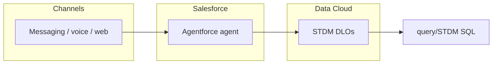

# External Support Assistant

Salesforce project for an **external-facing support agent** (Agentforce). Metadata and config live under `force-app/`; this repo also ships **read-only SQL** to reconstruct what happened in a session using Data Cloud STDM.

## Architecture

Runtime telemetry flows from the live conversation into **Data Cloud** as STDM DLOs (`ssot__AiAgentSession__dlm`, interactions, messages, steps, participants). You query those objects in your warehouse / Data Cloud SQL workspace—no extra app server in the middle.

**Query stack** (`query/STDM/`, run in order when exploring):

| # | File | Focus |
|---|------|--------|
| 1 | `1_full_session_overview.sql` | Session row |
| 2 | `2_session_participants.sql` | Who spoke |
| 3 | `3_interactions_per_turn.sql` | Turns / interactions |
| 4 | `4_messages_per_interactions.sql` | Messages per turn |
| 5 | `5_interaction_steps.sql` | Steps (actions, model calls, etc.) |
| 6 | `6_full_trace_one_shot.sql` | Single query: messages + steps joined |

Replace hard-coded **session IDs** (and verify DLO / field API names) for your org and bundle.
