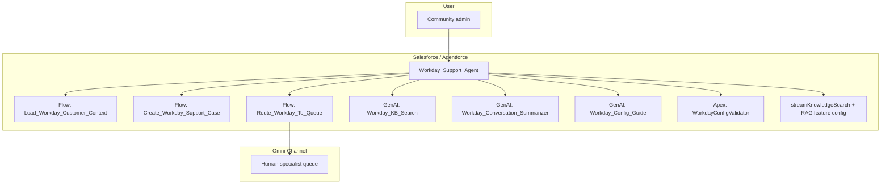
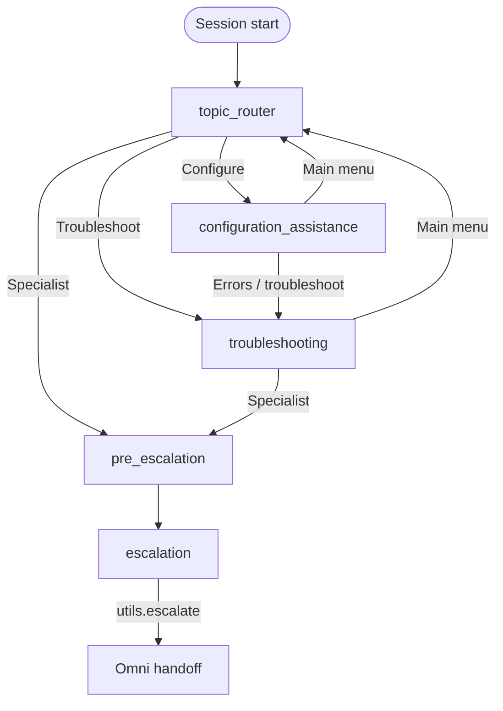

# Workday Support Agent — architecture

Agent definition: `force-app/main/default/aiAuthoringBundles/Workday_Support_Agent/Workday_Support_Agent.agent`  
Type: **AgentforceServiceAgent** · Entry: **`start_agent topic_router`**

## Runtime context

- **Channels**: community portal session supplies linked variables (`ContactId`, `admin_account_id`, `RoutableId` for Omni).
- **Knowledge**: RAG via `streamKnowledgeSearch` + `rag_feature_config_id` (`ARFPC_…`); optional KB search prompt `Workday_KB_Search`.
- **Handoff**: Omni-Channel flow `Route_Workday_To_Queue` after `utils.escalate`.

## System view



## Topic flow (FSM)



**ASCII (same story)**

```
                    ┌─────────────────┐
                    │  topic_router   │
                    └────────┬────────┘
           ┌─────────────────┼─────────────────┐
           ▼                 ▼                 ▼
   troubleshooting   configuration      pre_escalation
           │           _assistance              │
           │                 │                  │
           └────────►(menu)──┴──►troubleshooting │
           │                 │                  │
           └─────────────────┴──────────────────┤
                                                ▼
                                         escalation → Omni
```

## Capabilities by topic

| Topic | User-facing intent | Main integrations |
|--------|-------------------|-------------------|
| `topic_router` | Load admin context, choose path | Flow `Load_Workday_Customer_Context` |
| `troubleshooting` | KB-first (if verified), diagnose, case | `streamKnowledgeSearch`, GenAI `Workday_KB_Search`, summarizer + Flow case create |
| `configuration_assistance` | KB-first, guides, validation | `streamKnowledgeSearch`, GenAI `Workday_Config_Guide`, Apex `WorkdayConfigValidator` |
| `pre_escalation` | Summary + case if missing | GenAI `Workday_Conversation_Summarizer`, Flow `Create_Workday_Support_Case` |
| `escalation` | Transfer | `utils.escalate` → `Route_Workday_To_Queue` |

## Session variables (logical groups)

- **Identity**: `ContactId`, `admin_account_id`, `admin_name`, `support_tier`, `identity_verified`, `RoutableId`
- **Issue**: `issue_type`, `workday_module`, `issue_summary`, KB flags (`knowledge_first_enabled`, thresholds)
- **Case / handoff**: `case_created`, `case_number`, `predicted_priority`, `predicted_product_area`, `ai_summary`, `ai_transcript`, `escalation_initiated`
